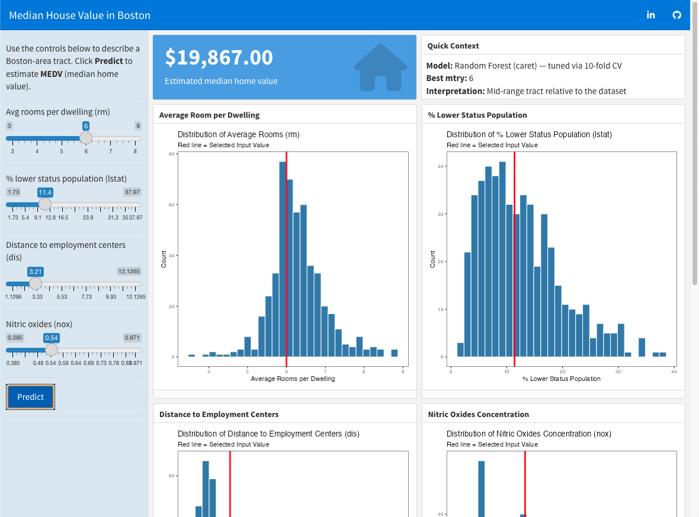

# Predicting Median House Value in Boston

## Executive Summary
This project develops and evaluates predictive models to estimate median owner-occupied home values (medv) in Boston using socioeconomic, environmental, and structural indicators from the Boston Housing dataset. Multiple modeling approaches were compared — including a baseline mean predictor, Multiple Linear Regression, Elastic Net, and Random Forest.

While linear models explained approximately 76% of variance, the Random Forest model significantly outperformed all alternatives, achieving:

* RMSE: 3.10
* MAE: 2.12
* R^2: 0.896

The final solution includes a reusable scoring function, making the model deployment-ready for urban planning, housing policy evaluation, and investment decision support.

## Business Problem
Boston’s housing authorities and urban developers face a complex challenge:

* Property valuation depends on interconnected factors such as crime rate, environmental quality, infrastructure access, and socioeconomic composition.

Traditional linear analysis may fail to capture:

* Non-linear interactions
* Multicollinearity among predictors
* Environmental and socioeconomic effects operating simultaneously

Business Objectives:

* Predict median home value (medv) at the census tract level
* Identify interpretable drivers of property value
* Build a model that generalizes well to unseen neighborhoods

Success Criteria:

* Primary metric: RMSE (Root Mean Squared Error)
* Secondary metrics: MAE and R^2
* Practical goal: A model that is both accurate and interpretable

## Exploratory Data Analysis & Key Trends
**Dataset characteristics:**

* 506 observations
* 13 predictors + 1 target
* No missing values
* No duplicates
* Target variable capped at 50 (top-coded ceiling effect)

**Key Findings from EDA:**

* **Strong Structural Driver: Rooms (`rm`)**

  * Clear positive linear relationship
  * Larger homes --> higher property values

* **Dominant Socioeconomic Driver: Lower Status Population (`lstat`)**

  * Strong negative relationship
  * Higher `lstat` --> significantly lower housing values

* **Environmental Impact**

  * Higher nitrogen oxide concentration (`nox`) --> lower values
  * Higher crime rate (`crim`) --> lower values (log-transformed relationship)

* **Multicollinearity Observed**

  Correlation heatmap revealed clusters among:

  * Infrastructure variables
  * Environmental measures
  * Tax and access indicators

  This justified inclusion of:

  * Regularized regression (Elastic Net)
  * Tree-based methods (Random Forest)

* **Target Distribution**

  * Median home value mean: ~22.53 ($1000s)
  * Ceiling effect at 50 confirmed
  * Mild right skew
  * High-value tracts compressed due to top-coding

This ceiling effect explains some systematic underprediction at the upper range.

## Model Explored & Results
Models were trained using repeated 10-fold cross-validation and evaluated on a holdout test set (20%).

Model | RMSE | MAE | R^2
|:---|---:|---:|---:|
Random Forest | 3.10 | 2.12 | 0.896 |
Linear Regression | 4.59 | 3.37 | 0.761 |
Elastic Net | 4.59 | 3.37 | 0.764 |
Baseline (Mean) | 9.32 | 6.60 | N/A |

**Baseline Model**

Predicting the training mean yielded:

* RMSE = 9.32

  Establishes minimum performance benchmark.

**Multiple Linear Regression**

* Strong interpretability
* Explains ~76% of variance
* Some residual tail deviations suggest non-linearity

**Elastic Net (α = 0.25, λ ≈ 0.1125)**

* Similar predictive performance to OLS
* Improved coefficient stability
* Top predictors:
  * `lstat`
  * `rm`
  * `dis`
  * `ptratio`

**Random Forest (Best Model)**

* Optimal mtry = 6
* Captures non-linear interactions
* Significant performance improvement
* Explains nearly 90% of variance
* Top Feature Importances
  * `lstat`
  * `rm`
  * `dis`
  * `crim`
  * `ptratio`
  * `nox`

Notably, both linear and non-linear models consistently identified socioeconomic composition and structural housing characteristics as dominant value drivers.

## Dashboard Preview

The tuned Random Forest model (10-fold CV, RMSE ≈ 3.10, R^2 ≈ 0.89) was deployed as an interactive Shiny dashboard that enables real-time housing value simulation. Users adjust key drivers — rooms (rm), socioeconomic composition (lstat), accessibility (dis), and environmental quality (nox) — to instantly generate predicted median home values (MEDV).

Each input is contextualized against the original data distribution, strengthening interpretability and responsible model use. Feature importance analysis confirms that structural and socioeconomic factors dominate valuation dynamics.

This deployment demonstrates end-to-end capability — translating validated machine learning models into an interactive, stakeholder-ready decision-support application.

## Reflection & Lessons Learned
This project demonstrates the complete CRISP-DM lifecycle:

**Key Insights:**

* Housing valuation is driven by a mix of:
  * Socioeconomic composition
  * Structural housing characteristics
  * Environmental quality
* Linear models perform well, but:
  * Non-linear interactions are substantial
  * Tree-based ensembles significantly improve performance
  
**Technical Lessons:**

* Top-coded targets can distort upper-range predictions
* Multicollinearity affects coefficient stability but not necessarily predictive accuracy
* Cross-validation repetition improves model reliability
* Random Forest excels in mixed socioeconomic datasets

**Strategic Takeaways:**

* Flexible ensemble methods are preferable when:
  * Variables interact
  * Socioeconomic indicators overlap
  * Environmental factors introduce non-linearity
* However, linear models remain valuable for interpretability and policy communication.
